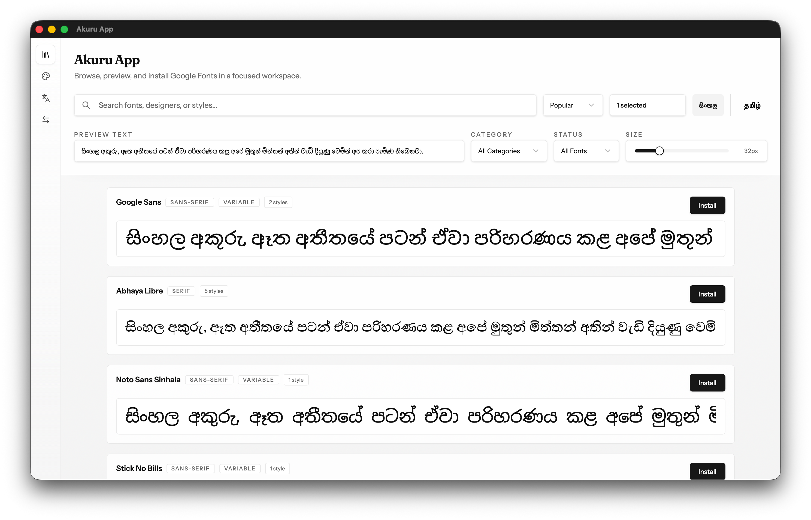
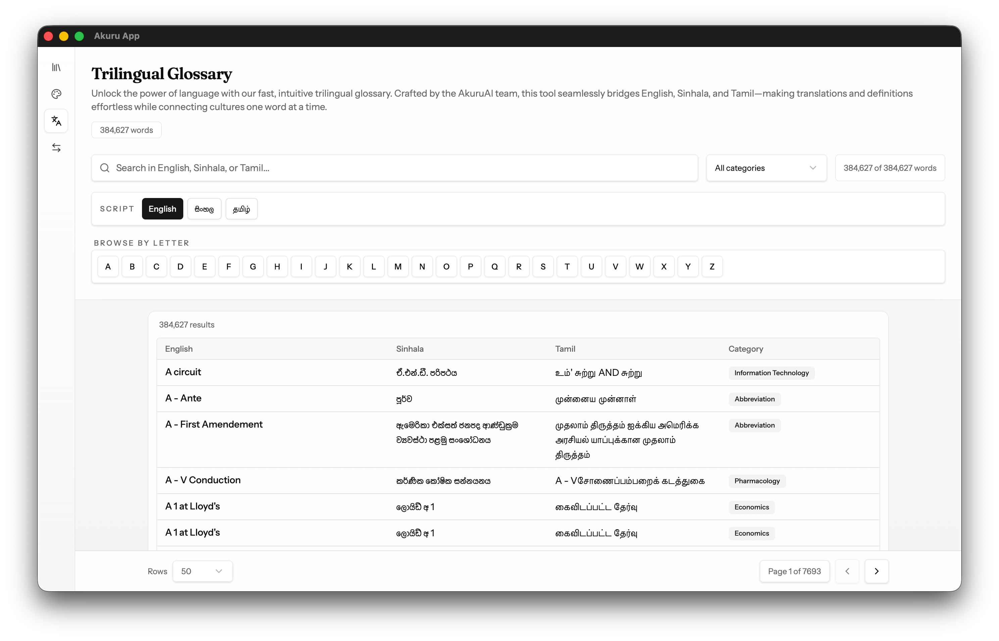
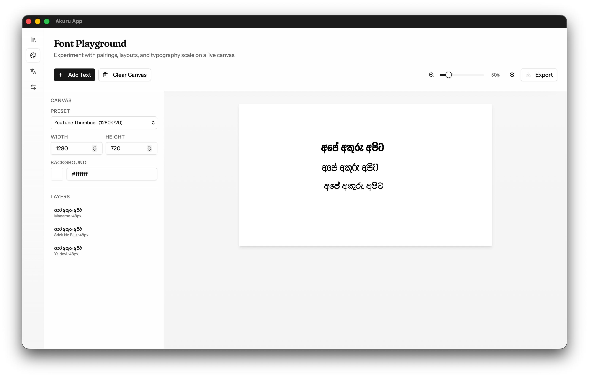

<section class="hero">
  
  <h1>Akuru App</h1>
  
A desktop super app for Sri Lanka for individuals, businesses, and organisations working with text, fonts, and writing in Official Languages.

  Alpha
</section>

<section class="screenshots">
  

    

      
      
      
      
    

  

</section>

<section class="features">

## What's inside

**Font Library** — Browse, preview, and install fonts from Google Fonts in a focused workspace. Optimised for Sinhala, Tamil, and Latin scripts. Starting May 2025, the library will host a range of new original fonts.

**Font Playground** — Experiment with font pairings and typography on a live canvas. Export PNG or vector files for use in other applications without downloading or installing anything.

**Trilingual Glossary** — 384,627 technical terms in English, Sinhala, and Tamil, sourced from the Official Languages Department of Sri Lanka.

**Text Converter** — The most advanced ASCII to Unicode converter for Sinhala text.

</section>

<section class="cta">

## Get early access

Launched on 21 February 2026 — World Mother Language Day. Join the waitlist to get access to the alpha.

[Join the Waitlist](mailto:hello@mooniak.com){: .btn}

</section>
